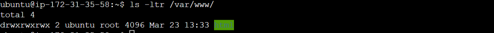

# schedule-Cron-job-task

In this project, we would schedule a cron job task to automate the updates to web app using Html, CSS, Apache and PHP.

## Introduction

`Crontab` will be used to automate the updates to the web app at a particular interval after changes are made to the code.

## Prerequisites

- Linux Environment
- AWS EC2 instance
- Basic understanding of Cron Jobs for Scheduled Tasks (crontab)
- Basic knowledge of Apache2 webserver installation and management
- Familiarity with PHP and configuring web servers

## Step-by-Step Implementation

### Step-1 : Update the Package manager and install Apache2 webserver

- Update package manager

```
sudo apt update
```

- Install apache2 webserver

```
sudo apt install apache2 -y
```

- Confirm apache is active and running.

```
sudo systemctl status apache2
```


### Step-2 : php installation

- Install php

```
sudo apt install php
```

### Step-3 : Configure Ownership and Permission

- Change Ownership of the '/var/www/html' directory to the user 'ubuntu'. Here, we will give the user `ubuntu` ownership to make changes to the file:

Before changing ownership, you can run the below code to check the original ownership:

```
ls -ltr /var/www/html
```

- Now change the ownership:

```
sudo chown ubuntu /var/www/html
```


- Set permissions on the /var/www/html directory for demonstration purposes (not recommended for production)

```
sudo chmod 777 /var/www/html
```



### Step-4 : Create a Cronjob that schedules the execution of the of updating the home.html file command every 10 minutes

- Edit the crontab file

```
sudo crontab -e
```

- Add the following line to the crontab file:

```
*/10 * * * * /var/www/html/home.html
```

> we intend to periodically run updates on the home.html file every 10 mins. This file will be served by PHP.


- Create `home.html file`

```
touch /var/www/html/home.html

```


### Step-5 : Create a PHP script to display the generated content from `home.html`

- Create 'home.php' file in '/var/www/html' directory

```
touch /var/www/html/home.php
```

- Populate the file with the following PHP script:

```
<?php

echo "Server Timestamp: ";
echo date("h:i:sa");


include("home.html");


?>
```

Ensure that the `home.html` file exists in the same directory as this PHP script or provide the correct path if located elsewhere. Also, ensure that the web server has permission to read the home.html file and that PHP is properly configured on your server.

### Step-7 : View the output from your browser

- Access `<public_ip_address>/home.php` to view the generated output.


_This output provides information about the home.html page at first deployment, we shall watch out for updates to the page after every `10mins`_

- Changes to the home.html code after 10mins, take note of the `email` field, `button color`, `timestamp` and `background-color`.
  
